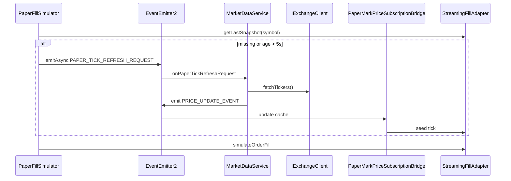

# M42 — Paper stale-tick REST refresh before fill simulation

> **Sequencing note:** M42 is a **paper fill-integrity** milestone surfaced by the 2026-06-19 operator
> report (`docs/wip/2026-06-17-halt-blocks-protective-close-and-shadow-fill-regression.md` context).
> Gate-approved OP/UNI opens at 14:05 UTC showed `gate_allowed=true` but `position_id=null` because
> `StreamingFillAdapter` refused a WS tick cache ~26 minutes old. M42 adds a **per-symbol REST recovery
> path** at fill time without introducing a `PaperModeModule` → `ExchangeModule` circular import.
> Parent investigation also surfaced misleading Decisions UI (M41 D1) and a zero-fill audit bug (M41 D3);
> those are **out of scope** here.

## Findings → scope decision

| # | Finding | Severity | M42 scope |
|---|---------|----------|-----------|
| 1 | Paper fill simulator returns `filled=false` when cached tick age > `STREAMING_FILL_STALE_TICK_MS` (5s) and WS cache is minutes stale | **HIGH (paper soak)** | **IN.** Event-driven REST `fetchTickers` refresh + retry fill. |
| 2 | Decisions feed shows green OPEN for risk rejects / unfilled approvals | MEDIUM (UX) | **Out → M41 D1.** |
| 3 | Zero-fill audit insert fails (`cashflow` NOT NULL) | MEDIUM (audit) | **Out → M41 D3.** |

### Production evidence (2026-06-19 14:05 UTC)

```text
symbol          action  reason           gate_allowed  position_id
UNI/USDT:USDT   open    momentum_follow   true         null
OP/USDT:USDT    open    momentum_follow   true         null
```

Engine logs:

```text
StreamingFillAdapter: cached tick stale (age=1556061ms > 5000ms)
PAPER createOrder filled=false
no-fill terminal state=cancelled
```

---

## D1 (HIGH) — Per-symbol REST tick refresh on stale/missing cache

### Root cause

`PaperMarkPriceSubscriptionBridge` seeds `StreamingFillAdapter` from `PRICE_UPDATE_EVENT` (WS
`!ticker@arr`). When the socket batch omits a symbol or WS disconnects, the per-symbol cache can be
minutes old while volatility triggers still fire at bar close. `PaperFillSimulator` correctly refuses
stale ticks but had **no recovery path** — approved intents terminated as `no-fill` / `cancelled` with
slot reservation released.

### Decision

Event-driven refresh (avoids `PaperModeModule` importing `ExchangeModule`):



1. Before fill simulation, `PaperFillSimulator.ensureFreshTickCache()` checks
   `streamingAdapter.getLastSnapshot(symbol)`.
2. If missing or `nowMs - snapshot.ts > STREAMING_FILL_STALE_TICK_MS`, emit
   `PAPER_TICK_REFRESH_REQUEST` with `{ symbol, nowMs }`.
3. `MarketDataService.onPaperTickRefreshRequest` calls `fetchTickers()`, finds the symbol, calls
   `emitPriceUpdate` (re-emits `PRICE_UPDATE_EVENT` with `payload.nowMs` as timestamp).
4. `PaperMarkPriceSubscriptionBridge` updates `StreamingFillAdapter`; fill proceeds on the refreshed cache.

**Not in scope:** fleet-wide halt on stale data; WS reconnect architecture; LIVE exchange REST fallback
(paper-only — LIVE uses real exchange fills).

### Files

| File | Change |
|------|--------|
| `apps/engine/src/common/const/eventConsts.ts` | `PAPER_TICK_REFRESH_REQUEST` |
| `apps/engine/src/market-data/interface/IPaperTickRefreshRequest.ts` | payload interface |
| `apps/engine/src/market-data/service/MarketDataService.ts` | `@OnEvent` handler |
| `apps/engine/src/paper-mode/service/PaperFillSimulator.ts` | `ensureFreshTickCache` + `EventEmitter2` inject |
| `apps/engine/src/market-data/service/__tests__/MarketDataService.paperTickRefresh.spec.ts` | handler tests |
| `apps/engine/src/paper-mode/__tests__/PaperFillSimulator.staleTickRefresh.spec.ts` | emit + fill retry |
| `apps/engine/src/paper-mode/__tests__/PaperFillSimulator.idempotency.spec.ts` | constructor stub |
| `apps/engine/src/paper-mode/__tests__/PaperR4Fixes.regression.spec.ts` | constructor stub |

### Acceptance (D1)

- **A1:** When cache tick age > 5s at fill time, `fetchTickers` is invoked once and `PRICE_UPDATE_EVENT`
  fires for that symbol before `simulateOrderFill` runs.
- **A2:** When REST refresh succeeds, a gate-approved open produces `filled=true` (regression vs 14:05 OP/UNI).
- **A3:** When REST refresh fails (transport error or symbol missing), behavior unchanged — missed fill,
  reservation released.
- **A4:** No new `PaperModeModule` → `ExchangeModule` import; refresh handler lives in `MarketDataService`
  (already owns `IExchangeClient`).

### Constants (locked)

- `STREAMING_FILL_STALE_TICK_MS = 5_000` — `apps/engine/src/paper-mode/const/paperFillSimulatorConsts.ts`
- `PAPER_TICK_REFRESH_REQUEST = 'paper.tick.refresh.request'`

---

## Dispatch waves

Single engine wave (≤5 production files + tests). No shared-contract change, no migration.

1. **Serial (engine):** D1 implementation.
2. **Serial (QA):** paired unit tests (A1–A4).
3. **Deferred:** full four-reviewer wave — operator hotfix scope; revisit if soak shows REST refresh storms.

## Cross-cutting non-goals

- Changing `STREAMING_FILL_STALE_TICK_MS` threshold.
- Proactive background REST polling (refresh is on-demand at fill time only).
- Shadow fill path (separate mechanism; see M40 D2).

## ADRs

- **No new ADR.** Paper fill simulator determinism contract (ADR 0032 §D3) unchanged — refresh only
  supplies a fresher reference price; idempotency ledger still keyed on event/order intent.

---

## Outcome (2026-06-19)

**Status: DONE (engine + unit tests).**

- D1 shipped: event `PAPER_TICK_REFRESH_REQUEST`, `MarketDataService.onPaperTickRefreshRequest`,
  `PaperFillSimulator.ensureFreshTickCache`.
- **Tests:** 14 passing across `PaperFillSimulator.staleTickRefresh`,
  `MarketDataService.paperTickRefresh`, idempotency, and R4 regression stubs.
- **Post-deploy check (operator):** on next gate-approved open where WS cache is stale, confirm log line
  `paper tick refresh: seeded symbol=… from REST (stale WS cache)` and position opens.
