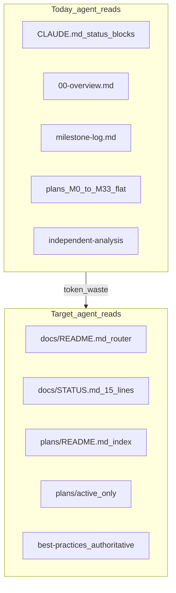

# Documentation structure reorganization

**Status:** PLANNED — proposal only; no structural moves until approved.
**Type:** Meta / tooling. Markdown-only. No application code.
**Created:** 2026-06-12

---

## Goals

Optimized primarily for **Claude Opus** sessions (Sonnet secondary). Docs must behave as
**live agent memory**: a permanently maintained, single-writer knowledge base — not a pile
of artifacts an agent greps through.

1. **Cut resident (always-on) token overhead first** — the dominant per-turn cost is the
   always-applied context (skill manuals + `CLAUDE.md` status blocks), not task-specific
   reads. Demote reference manuals to on-demand; keep only true invariants always-on. See
   [Problem statement](#problem-statement) for the measured numbers.
2. **Faster LLM navigation** — one entry point (`docs/README.md`) with task-based routing
   instead of wandering `docs/plans/` or loading stale status blocks.
3. **Minimize task-read token waste** — explicit read/skip lists and token budgets per task
   type; quarantine forensics (`independent-analysis/`, done plans) from default paths.
4. **Separate implemented vs pending** — active milestone specs in `plans/active/`; done specs
   in `plans/archive/`; living status in `docs/STATUS.md` (not triplicated in `CLAUDE.md` and
   `milestone-log.md`).
5. **Keep memory from rotting** — every navigational/status doc has exactly one writer and a
   mandatory update step; CI guards against stale indexes and broken links. See
   [Live-memory write protocol](#live-memory-write-protocol).

## Non-goals

- Rewriting milestone plan content or ADR bodies.
- Changing [code-conventions.md](../../best-practices/code-conventions.md) or [dev-qa-cycle.md](../../best-practices/dev-qa-cycle.md).
- Deleting historical docs (archive, don't discard).
- Implementing any phase below until this WIP doc is reviewed and scope is chosen.

---

## Problem statement

### Resident (always-on) overhead — the largest single cost

Measured 2026-06-12. Loaded on **every** Opus turn regardless of task:

| Always-applied source | ~Tokens / turn |
|-----------------------|----------------|
| `.agents/skills/nestjs-best-practices/AGENTS.md` | ~40,800 |
| `.agents/skills/vercel-react-best-practices/AGENTS.md` | ~27,100 |
| `.agents/skills/redis-development/AGENTS.md` | ~16,200 |
| [CLAUDE.md](../../../CLAUDE.md) (incl. M21–M32 status paragraphs) | ~4,600 |
| **Fixed overhead per message** | **~88,700** |

The entire `docs/` read-routing reorg only saves tokens on *task-specific reads* (8k–40k,
see [budgets](#token-budget-targets)). The ~89k resident cost dwarfs it. The three skill
manuals are full reference docs that the repo **already mirrors** as on-demand SKILL.md files
under `.claude/skills/`; keeping them always-applied is pure waste on most tasks. Demoting
them is the highest-ROI action and is added below as **Phase 0**.

### Read-routing and freshness issues

| Issue | Impact on agents |
|-------|------------------|
| ~149 files under `docs/` with no top-level hub | Agents read [00-overview.md](../../plans/00-overview.md) (partly stale) or grep blindly |
| Flat [docs/plans/](../../plans/) — M0–M33 mixed (42 plan files) | Cannot tell done vs active without opening each file |
| Status triplication | Long blocks in [CLAUDE.md](../../../CLAUDE.md) (always-on), [milestone-log.md](../../milestone-log.md) (~23k tokens), stale roadmap in `00-overview.md` (stops ~M27; current work is M33) |
| [independent-analysis/](../../archive/independent-analysis/) (40 pre-review artifacts) | Loaded by mistake during implementation |
| 44 ADRs by number only; [0004-risk-management.md](../../architecture/adr/0004-risk-management.md) is **1,213 lines** | Agents read the entire 1.2k-line ADR when only one § matters |
| **ADR number collision**: `0024-telegram-alerts.md` AND `ADR-0024-alert-schema.md` both exist | Ambiguous citations; index masks a real memory-integrity bug |
| ~90 files reference `docs/plans/M…` | Future file moves require a link-update pass — must be CI-guarded |
| No write protocol for status/index docs | Memory rots: `00-overview.md` roadmap already drifted ~6 milestones behind |



---

## Target directory layout

```
docs/
├── README.md                 # Agent entry: task routing table
├── STATUS.md                 # Living snapshot (~15 lines)
├── agent-guides/             # Task playbooks (implement / fix / review)
├── plans/
│   ├── README.md             # Index: status + 1-line summary + ADRs
│   ├── active/               # M33 + near queue
│   ├── archive/              # Done milestones
│   └── 00-overview.md        # Timeless design only (trim stale roadmap)
├── architecture/
│   ├── README.md
│   ├── data-model.md
│   ├── live-vs-backtest-contract.md
│   └── adr/
│       └── README.md         # Topic → ADR map
├── best-practices/           # Unchanged — always authoritative
├── runbooks/
│   └── README.md
├── wip/                      # Pre-milestone analysis (existing pattern)
├── archive/
│   └── independent-analysis/ # Quarantined forensics
├── milestone-log/            # Optional: header + archive/MN.md per milestone
├── tech-debt.md
└── work-log.md
```

Root `AGENTS.md` (**not optional** — cheapest always-on router, privileged by Cursor and
Claude): a 3-line file → "Invariants in `CLAUDE.md`; read `docs/README.md` first for task
routing; current status in `docs/STATUS.md`."

---

## Single sources of truth

| Concern | Owner doc | When to read |
|---------|-----------|--------------|
| Hard rules + trading invariants | [CLAUDE.md](../../../CLAUDE.md) (~60–90 lines after slim) | Every session |
| Where we are now | `docs/STATUS.md` (to create) | Every session |
| Task routing | `docs/README.md` (to create) | Every session |
| Timeless architecture + locked decisions | [00-overview.md](../../plans/00-overview.md) | New contributors, large features |
| Milestone outcomes (forensics) | [milestone-log.md](../../milestone-log.md) → split archive | Regressions, "why was this built?" |
| Active implementation spec | `docs/plans/active/MN-*.md` | Current milestone work |
| Deferred work | [tech-debt.md](../../tech-debt.md) | Planning, go-live gates |
| Pre-milestone gaps | [docs/wip/](.) | Before plan freeze |
| Code style (authoritative) | [code-conventions.md](../../best-practices/code-conventions.md) | Before engine code |
| QA / dispatch process | [dev-qa-cycle.md](../../best-practices/dev-qa-cycle.md) | Before fix/QA waves |

---

## Agent routing table

**Default rule:** Do not read `milestone-log.md`, `independent-analysis/`, or archived plans unless the task requires forensics.

| Task | Read (in order) | Skip by default |
|------|-----------------|-----------------|
| Implement active milestone | `STATUS.md` → active plan → ADRs from plan/frontmatter → `code-conventions.md` → relevant architecture doc | `independent-analysis/`, done plans, full `00-overview` |
| Small bugfix (known area) | `STATUS.md` → grep `milestone-log` for MN → ADR topic section → `code-conventions.md` | Full plans, `00-overview` |
| Touch risk / halts / depth | ADR 0004 (+ 0042 if paper) relevant § only → `riskConsts.ts` | M19–M28 plan files |
| Touch execution / fills | ADR 0005, 0007, 0011, 0029 as needed → `live-vs-backtest-contract.md` | Full milestone plans |
| Dashboard / read API | ADR 0026, 0022, M10 plan (archive) → dashboard conventions | Engine plans unless API contract |
| Code review | Diff + `code-conventions.md` + relevant ADR sections | Plans unless spec dispute |
| Ops / deploy / DB | `runbooks/` index → specific runbook | All plans |
| Forensics / regression | `milestone-log` (grep MN) → WIP `done/` → `independent-analysis/` | — |

### Token budget targets

| Scenario | Target reads | ~Tokens |
|----------|--------------|---------|
| Small bugfix | STATUS + 1 ADR section + conventions | under 8k |
| Active milestone | STATUS + active plan + 2–4 ADRs + conventions | under 25k |
| Architecture / contract change | Above + `data-model.md` + architect ADR draft | under 40k |
| Full history / multi-model reviews | `archive/independent-analysis/` | optional, unbounded |

---

## Live-memory write protocol

Routing only fixes the *read* side. For docs to act as durable memory (and not rot like
`00-overview.md` did), the *write* side must be as crisp as the read side and CI-enforced.

### Memory classes

| Class | Docs | Write rule |
|-------|------|------------|
| **Invariant** (rarely changes) | `CLAUDE.md` hard rules + trading invariants, `best-practices/`, ADR bodies | Edited only by deliberate decision; ADRs are amended, never silently rewritten |
| **Mutable working memory** (overwritten each milestone) | `STATUS.md`, `plans/README.md` index | **Single writer = scribe.** Overwritten as the last, non-optional step of every milestone close |
| **Append-only episodic memory** (never edited retroactively) | `milestone-log.md` (+ future `milestone-log/archive/MN.md`), `work-log.md` | Append new entries only; never edit or delete history |

Agents must not edit episodic memory retroactively, and must not trust working memory that
fails the staleness guard below.

### Mandatory update step (belongs in `dev-qa-cycle.md`, not just here)

Add to the scribe wave / milestone-close checklist, with the same status as "tests green":

1. Append the milestone outcome to `milestone-log.md` (episodic).
2. Overwrite `STATUS.md` (active → new active; last DONE; deploy state; next queue).
3. Flip the milestone row in `plans/README.md` (`ACTIVE` → `DONE`), move plan to `archive/`.
4. Replace the `CLAUDE.md` status pointer (no per-milestone paragraph — link to `STATUS.md`).

A milestone is **not closed** until these four are done.

### CI guards (mandatory, not optional)

| Guard | Check | Prevents |
|-------|-------|----------|
| **Link check** | `rg` / markdown-link-check across `docs/`, `CLAUDE.md`, `.claude/agents/` | Broken links after Phase-2 moves (~90 ref surface) |
| **Staleness guard** | ACTIVE in `STATUS.md` == single `ACTIVE` row in `plans/README.md`; no plan listed both `active/` and `DONE` | Working memory drifting behind reality |
| **ADR integrity** | No duplicate ADR numbers; all match `NNNN-title.md` | Recurrence of the `0024` collision |

Without these, Phase 2's link surface and the index guarantee future drift — the exact
failure this initiative exists to fix.

---

## Plan index format (future `docs/plans/README.md`)

Columns: **ID** | **Status** | **Summary (1 line)** | **ADRs** | **Modules**

Status values: `ACTIVE` | `DONE` | `DEFERRED` | `INDEX` (split parent like M11)

### Optional YAML frontmatter on plan files

```yaml
---
milestone: M33
adr: [0008, 0011, 0012, 0015]
modules: [execution, position, risk]
---
```

**Do NOT put mutable `status:` in frontmatter.** Status across 42 files = 42 places to rot
and a second source of truth that contradicts Goal 4. Status lives in **one** place:
`plans/README.md`. Frontmatter is only worth it for *static* metadata fixed once a plan
ships (`adr:`, `modules:`) — useful for `grep` without opening files. If the index alone is
enough, skip frontmatter entirely.

### Current milestone snapshot (seed for future `STATUS.md`)

| Field | Value |
|-------|-------|
| **ACTIVE** | **M33** — Live exit enforcement ([M33-live-exit-enforcement.md](../../plans/archive/M33-live-exit-enforcement.md)); source [live-exit-enforcement-gap.md](../live-exit-enforcement-gap.md) |
| **Last DONE** | **M32** — Dashboard closed positions + Telegram alerts |
| **Deploy** | M32 engine restart pending; M33 not started (no code landed) |
| **Next queue** | M15 (gated on M11a soak + testnet drill); slot-C (soak-gated per [tech-debt.md](../../tech-debt.md)) |

### Milestone status lists (for index migration)

**ACTIVE**

| ID | Plan file |
|----|-----------|
| M33 | `M33-live-exit-enforcement.md` |

**DONE** (ship complete per [milestone-log.md](../../milestone-log.md))

M0, M1, M2, M3, M4, M5, M5.5, M6, M7, M8, M9, M10, M11a, M12, M13, M14, M16, M17, M18, M19, M21, M22, M23, M24, M25, M26, M27, M28, M29, M30, M31, M32

**DEFERRED / GATED** (plan exists; not active work)

| ID | Plan file | Gate |
|----|-----------|------|
| M11 | `M11-go-live-hardening.md` | Index — split into M11a + M15 |
| M15 | `M15-cloud-go-live.md` | M11a soak exit + testnet drill |
| M20 | `M20-pre-cloud-blocker-hardening.md` | Pre-cloud hardening backlog |

**EXECUTION PLANS** (dispatch checklists — archive after parent milestone ships)

`M9-execution-plan.md`, `M10-execution-plan.md`, `M12-execution-plan.md`, `M13-execution-plan.md`, `M14-execution-plan.md`

---

## ADR topic index (future `docs/architecture/adr/README.md`)

Read the ADR file for the topic. For **large ADRs the index must deep-link to section
anchors**, not just the file — otherwise the routing promise "ADR 0004 relevant § only" is
unreachable (the agent still loads 1,213 lines to find the §). Deliverable: anchored
sub-entries for every ADR over ~400 lines (0004 first), e.g.
`0004-risk-management.md#6a-depth-floor`, `#6c-index-shock`, `#8a-sizing`.

**Fix the `0024` collision as part of this work.** Two files share number 0024:
`0024-telegram-alerts.md` (M9) and `ADR-0024-alert-schema.md` (M32). Renumber the M32 one to
the next free number, rename to the `NNNN-title.md` convention, and update its references
(`CLAUDE.md` M32 block, any cross-links). The index below still shows the collision and must
not ship that way.

### Exchange and market data

| ADR | Title |
|-----|-------|
| 0001 | Exchange integration & market-data boundary (M1) |

### Persistence and data model

| ADR | Title |
|-----|-------|
| 0002 | Persistence & data model (M2) |

### Strategy

| ADR | Title |
|-----|-------|
| 0003 | Strategy engine (M3) |
| 0016 | Strategy version lineage & promotion model (M8) |
| 0017 | Walk-forward splits & same-event comparison (M8) |
| 0018 | Statistical significance: paired block bootstrap (M8) |
| 0019 | Promotion gate (M8) |

### Risk, halts, paper profile

| ADR | Title |
|-----|-------|
| 0004 | Risk management (M4) — depth, breadth, stress, sizing, slots |
| 0042 | Paper exploration profile (M25) |
| 0043 | Decision data-capture completeness (M27) |

### Execution and orders

| ADR | Title |
|-----|-------|
| 0005 | Execution order policy (M5) |
| 0006 | Idempotency contract (M5) |
| 0007 | Partial-fill semantics (M5) |
| 0008 | SL/TP attach & protective-order fallback (M5) |
| 0011 | Local SL/TP fallback & held-symbol subscription (M6) |
| 0030 | In-engine rate-limit token-bucket policy (M11a) |

### Position, reconciliation, recovery

| ADR | Title |
|-----|-------|
| 0009 | Position state machine (M6) |
| 0010 | Reconciliation & drift policy (M6) |
| 0012 | Funding cashflows + realized/unrealized PnL (M6) |
| 0013 | Lifetime position instrumentation (M6) |
| 0014 | Crash recovery & re-association (M6) |

### Backtest, shadow, paper mode

| ADR | Title |
|-----|-------|
| 0015 | BacktestModule (M7) |
| 0029 | Shadow counterfactual + fill-simulator pipeline (M11a) |
| 0032 | PAPER mode architecture |

Also: [live-vs-backtest-contract.md](../../architecture/live-vs-backtest-contract.md)

### Observability, auth, control (M9)

| ADR | Title |
|-----|-------|
| 0020 | Auth, CORS & token lifecycle |
| 0021 | Kill-switch contract |
| 0022 | Read API surface |
| 0023 | WS/SSE gateway |
| 0024 | Telegram alerts (outbound-only) |
| ⚠️ 0024 (dup) | Alert schema & Telegram position notifications (M32) — **renumber before shipping the index** (collides with the M9 0024 above) |
| 0025 | Startup schema-validation gate |
| 0031 | `revoked_jti` TTL prune + age-floor |

### Dashboard (M10)

| ADR | Title |
|-----|-------|
| 0026 | Dashboard architecture & topology |
| 0027 | Login endpoint with bootstrap secret |

### Go-live hardening

| ADR | Title |
|-----|-------|
| 0028 | Key-permission assertion port (M11a) |

### Phase 2 — MCP, agent, CI

| ADR | Title |
|-----|-------|
| 0033 | MCP module-boundary enforcement |
| 0034 | MCP DB isolation: read-only role |
| 0035 | `apps/agent/` structural boundary |
| 0036 | `agent_writer` role + draft SDF |
| 0037 | LLM egress allowlist |
| 0038 | MCP HTTP localhost transport |
| 0039 | CI gate policy + branch protection |
| 0040 | Supply-chain SCA + lockfile integrity |
| 0041 | Dependency pinning for exchange deps |

---

## What stays unchanged

- [docs/best-practices/](../../best-practices/) — authoritative; agents always read conventions before engine work.
- [docs/wip/](./) pattern — active root + `done/` archive; promote to plan or `done/` when resolved.
- [docs/tech-debt.md](../../tech-debt.md) — deferred work index.
- Scribe workflow — per-milestone outcome sections in plan files + `work-log.md` + `milestone-log.md`.
- ADR files stay in place; only add navigational READMEs.

---

## Implementation phases

**Deferred until this WIP doc is approved.** Choose scope when starting implementation.

| Phase | Work | Risk |
|-------|------|------|
| **0** | **Resident-context audit.** Demote `nestjs-/vercel-react-/redis-` `AGENTS.md` from always-applied to on-demand skills (repo already mirrors them under `.claude/skills/`); keep only true invariants always-on. ~Saves the bulk of the ~89k/turn overhead. | Low — verify agents still load skills on demand for relevant tasks |
| **1** | Add `docs/README.md`, `docs/STATUS.md`, `plans/README.md`, `architecture/adr/README.md` (with 0024 renumber + 0004 anchors); slim `CLAUDE.md` status blocks → link to `STATUS.md`; root `AGENTS.md`; **add single-writer + mandatory-update rule to `dev-qa-cycle.md`**; **add CI link + staleness + ADR-integrity guards** | None — additive (CI guards land green against the new files) |
| **2** | Move done plans → `plans/archive/`; move `independent-analysis/` → `docs/archive/`; grep-fix links (~90 ref surface) — safe behind the Phase-1 CI link check | Medium — link pass required |
| **3** | Split `milestone-log.md` (~23k tokens): short header + `milestone-log/archive/MN.md` per milestone | Low |
| **4** | Add `docs/agent-guides/` (implement-milestone, fix-bug, touch-risk, review-only); static-only frontmatter (`adr:`/`modules:`) on active plans | Low |
| **5** | Update `.claude/agents/bot-scribe.md`, `bot-architect.md`, `bot-engine-nestjs.md`, root `README.md` | Low |

### Recommended rollout

1. **Phase 0 + Phase 1** — biggest token win (resident overhead) + zero-risk routing/memory scaffold, no file moves.
2. **Phase 0 + Phase 1–2** — after index format is validated; biggest clutter reduction, link pass guarded by CI.
3. Phases 3–5 — as needed.

> **Phase 0 caveat:** before demoting a skill, confirm the on-demand `.claude/skills/<name>/SKILL.md` exists and its trigger description fires for the relevant task types (engine = NestJS, dashboard = React, cache/queue = Redis). The goal is *lazy* loading, not *no* loading.

### Link-update checklist (Phase 2)

```bash
# Find plan path references before/after moves
rg 'docs/plans/M' --glob '*.{md,ts,tsx,yml}'
```

Update: `CLAUDE.md`, agent definitions, ADR cross-links, code comments citing plans, `README.md`, `tech-debt.md`.

---

## Acceptance criteria (implementation complete)

**Phase 0**

- [ ] The three reference-manual skills are no longer always-applied; they load on-demand for their task types. Measured resident overhead per turn drops by the bulk of the ~84k skill tokens.

**Phase 1**

- [ ] New agent session can follow `docs/README.md` without reading `milestone-log` or `independent-analysis` by default.
- [ ] `CLAUDE.md` under 90 lines; current status lives only in `docs/STATUS.md` (no per-milestone status paragraphs).
- [ ] Root `AGENTS.md` exists and points to `CLAUDE.md` + `docs/README.md` + `STATUS.md`.
- [ ] `docs/plans/README.md` lists every milestone with correct ACTIVE/DONE/DEFERRED status.
- [ ] `docs/architecture/adr/README.md` enables topic lookup; large ADRs (0004 first) deep-link to section anchors.
- [ ] The `0024` collision is resolved (M32 ADR renumbered + renamed; references updated).
- [ ] `dev-qa-cycle.md` includes the single-writer + mandatory 4-step milestone-close update rule.
- [ ] CI guards pass and are wired: link check, staleness guard (STATUS == index ACTIVE), ADR-integrity (no dup numbers).

**Phase 2 (if in scope)**

- [ ] `docs/archive/independent-analysis/` moved under `docs/archive/` with a "forensics only" README.
- [ ] No broken internal markdown links (CI link check green across `docs/`, `CLAUDE.md`, `.claude/agents/`).

---

## Approval and next steps

1. Review this WIP doc.
2. Reply with implementation scope: **Phase 0 + Phase 1** (recommended), **Phase 0 + Phase 1–2**, or adjustments.
3. Scribe updates `work-log.md` when implementation lands; move this file to `docs/wip/done/` when the chosen phases are complete.

**Revision note (2026-06-12):** Reworked from read-routing-only to a live-memory model —
added Phase 0 (resident-context audit, the largest token win), a write protocol with CI
guards, the `0024` ADR-collision fix, deep ADR anchors, and pushed back on mutable `status:`
frontmatter across 42 files. Original phases preserved and renumbered.

**Related:** This initiative does not block M33. M33 agents should continue using [M33-live-exit-enforcement.md](../../plans/archive/M33-live-exit-enforcement.md) and [live-exit-enforcement-gap.md](../live-exit-enforcement-gap.md) until the new routing docs exist.
