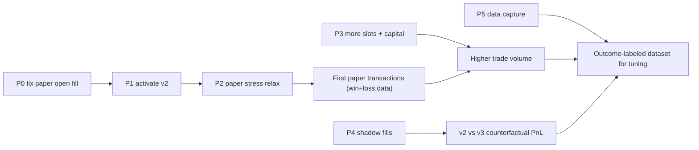

# Main-Architect Analysis: Paper Soak Fill + Gate

**Date:** 2026-06-06
**Author:** Main session (architect)
**Status:** DONE — archived under `docs/wip/done/`. **P0–P4 landed (M24–M26); P5 → M27.** See [Milestone coverage](#milestone-coverage) below.
**Companion:** [paper-soak-zero-trades-and-shadow-fill-gap.md](paper-soak-zero-trades-and-shadow-fill-gap.md)

---

## Milestone coverage

Tracked against [`docs/milestone-log.md`](../milestone-log.md) and plans under `docs/plans/`.

| WIP item | Milestone | Log status | Notes |
|----------|-----------|------------|-------|
| **P0** — paper open fill (`StreamingFillAdapter` tick synthesis) | [M24](../plans/M24-paper-open-fill-wiring.md) | **DONE** | Code-only; post-deploy fill-path confirmation still operator-gated |
| **P1** — activate v2 momentum (`ACTIVE_STRATEGY_VERSION_ID=3`) | [M25](../plans/M25-paper-exploration-enablement.md) | **DONE** | Config-only in M25 |
| **P2** — paper-only stress relaxation (`PAPER_RELAX_MARKET_STRESS`) | M25 | **DONE** | ADR 0042; breadth + invalid-inputs never relaxed |
| **P3** — more concurrent positions / slot headroom | M25 | **PARTIAL** | Exposure + capital headroom only; **3-slot ceiling unchanged** (true 5-slot expansion deferred). See [slot-model doc](../slot-model-and-correlated-leg-gaps.md) |
| **P4** — shadow counterfactual fills (bar evidence + `tick_aggregates`) | [M26](../plans/M26-shadow-counterfactual-fill-wiring.md) | **DONE** | M26 shipped: shadow now loads real `tick_aggregates` per event, aligns entry to next-bar open (M7 pattern), produces virtual PnL for counterfactual (ADR 0029); forward-only ledger + close-side proxy + analysis-layer missing-data detection documented. See `docs/milestone-log.md` M26 outcome. |
| **P5** — decision data-capture completeness | [M27](../plans/M27-decision-data-capture-completeness.md) | **PLANNED** | Requires migrations; not started in milestone-log |
| Gate / halt context (M19 depth skip, M21 shocks, M23 breadth resume) | M19, M21, M23 | **DONE** | Precedes this WIP; does not fix fill layer |
| WS connection pressure / escalation cap | — | **OPEN** | Separate WIP: [engine-ws-connection-pressure-and-binance-limits.md](engine-ws-connection-pressure-and-binance-limits.md) |

**Data-fix arc sequencing (from plans):** M24 → M25 → (M26 ∥ M27).

---

## 0. TL;DR

The operator wants to *see simulated transactions* (wins and losses are both fine) so there is real
outcome data to fine-tune strategies. After auditing the implementation, the conclusion is:

> The engine cannot open a single position in paper or shadow today — **not because of the strategy
> and not because of the risk gate, but because the live-event-time fill model treats every open as a
> missed fill.** Both the existing WIP doc and the operator's mental model assume that "switch to v2 +
> relax the gate" would produce paper fills. It will not.

There are **three stacked blockers**. All three must be cleared to see a transaction:

1. **Strategy layer** — active version is v1 mean-reversion, which skips 761× before the gate.
2. **Gate layer** — 78% of gate attempts are day-level stress halts that lock the whole UTC day.
3. **Fill layer (the silent killer)** — even a gate-approved open is recorded as `missed`
   (`fillPrice=0`, no position) because the fill model is fed an empty tick array.

Because the fill layer fails *last and silently*, fixing the strategy and the gate alone would still
yield zero positions. The fill fix (**P0**) is the true unlock.

This doc answers the operator's five questions, proves the three blockers with code, and gives a
prioritized, **paper-scoped** change set (P0–P5) that preserves the live/backtest determinism
contract.

---

## 1. Executive answers to the operator's questions

### Q1 — Why is the data incomplete?

Three independent failures stack on top of each other:

- **Strategy:** v1 mean-reversion is deliberately ultra-conservative (fade only after exhaustion
  confirmation; no fade against trend; no fade on idiosyncratic + rising OI). It emits `skip` 761×
  and only 350 open intents reach the gate in 14 days.
- **Gate:** of those 350, ~78% are rejected by day-level halts (`global_halt` 66% + `market_stress`
  12%). The stress thresholds that arm those halts are **engine constants**, and the M23 auto-resume
  only clears *breadth-only* halts.
- **Fill:** the handful that could pass the gate would be recorded as **missed fills** — so there are
  **zero realized outcomes anywhere in the engine** (live, paper, or shadow). We have a rich
  *decision funnel* but not a single *trade*.

So the data is "incomplete" in the most consequential way possible: we have inputs and rejections,
but **no fills, no PnL, no win/loss labels** to fine-tune against.

### Q2 — Is moving to a new strategy version good advice?

**Yes — necessary, but not sufficient.** v1 will never produce meaningful volume by design. Shadow
data proves v2 momentum has real appetite (583 open intents vs v1's 0 gate approvals on the same
event tape; v3 hybrid skips *all* catalyst flow, so it is the wrong choice for volume). Switch the
active version to **v2** (`ACTIVE_STRATEGY_VERSION_ID=3`). But understand: this changes nothing about
transactions unless the gate approves *and* the fill model is fixed.

### Q3 — Can we run 5 concurrent positions in paper? Should we add capital?

This is the most common misconception in the current config. **The live risk gate ignores
`MAX_OPEN_POSITIONS`.** Concurrency is governed by a hard-coded **3-slot model**
(`SlotManager`: slots A+B for at most 2 idiosyncratic positions, slot C for at most 1 BTC-correlated
position) via engine constants `MAX_IDIOSYNCRATIC_SLOTS=2` and `MAX_BTC_CORRELATED_POSITIONS=1`.

- To get **5 concurrent positions you need a code change** to the slot model (cleanly gated to paper),
  not an env or capital change.
- **Adding capital alone will not help.** The binding constraints are the slot count and
  `MAX_EXPOSURE_PER_COIN_USDT` ($100 default), not the $500 `ACCOUNT_CAPITAL_USDT`. If we raise slots,
  we should also raise the per-coin exposure cap and capital so sizing isn't the new bottleneck.

### Q4 — Is the risk gate too restrictive?

For the stated goal (collect both losing and winning outcomes in a volatile market), **yes — but the
restrictiveness is concentrated in the day-level stress halts, not the per-coin checks.** Once a day
is halted, even deep tier-1 names are rejected. The right move is a **paper-only relaxation** of the
stress thresholds so the day stops locking — this keeps the live/backtest contract intact because it
is scoped to `EXCHANGE_ENV=paper`.

Importantly, accepting "some decisions will be bad" is exactly right and aligns with the project's
skip-first philosophy *for analysis purposes*: bad paper trades are valuable labeled data. The gate's
conservatism is correct for live capital; it is simply mis-tuned for a paper *exploration* soak.

### Q5 — "What do we simulate if there is no result?"

Today: **nothing.** We simulate a funnel, not trades. There is no fill, so no realized PnL, no win
rate, no expectancy, no Sharpe — none of the M11b soak-exit or ADR 0018 bootstrap comparisons are
computable. To get "good data to analyze later," two things are required:

1. **Fix the fill model** so opens actually fill (P0 for paper; P4 for shadow counterfactuals).
2. **Close the data-capture gaps** so every decision and fill is analyzable (P5).

---

## 2. The three stacked blockers (with code evidence)

### 2.1 Strategy layer — v1 skips before the gate

v1 mean-reversion emits `skip` 761× in 14 days. Top skip reasons: `regime_suppressed` (348),
`idiosyncratic_trap` (272), `move_out_of_band` (98), `no_exhaustion_confirmation` (43). Core logic in
`apps/engine/src/strategy/strategies/meanReversionCore.ts`. Shadow v2 (momentum) emits **583** open
intents on the same `event_id` tape — proof the tape is tradeable; v1 simply chooses not to.

### 2.2 Gate layer — day-level halts dominate

The halt check runs first in the gate pipeline and short-circuits everything else:

```461:480:apps/engine/src/risk/service/RiskGateService.ts
    private async firstFailingHaltCheck(context: IRiskGateContext, state: ILoadedState): Promise<RejectReasonEnum | null> {
        if (!Number.isFinite(context.nowMs)) {
            return RejectReasonEnum.GLOBAL_HALT;
        }
        // ... M23 UTC rollover resets ...
        if (context.modelDivergenceDetected) {
            return RejectReasonEnum.MODEL_DIVERGENCE_HALT;
        }
        if (state.today !== null && state.today.isHalted) {
            const dayHaltReason = await this.resolveDayHalt(context, state);
            if (dayHaltReason !== null) {
                return dayHaltReason;
            }
        }
```

Gate-reject breakdown (350 attempts): `global_halt` 232 (66%), `market_stress` 42 (12%),
`sl_outside_liquidation` 33 (9%), `coin_book_too_thin` 21 (6%), `no_eligible_slot` 13 (4%),
`exposure_cap_per_coin` 7 (2%). Combined day-level halts = **78%**.

The stress legs are armed by `StressHaltEvaluator.isStressed`, and almost every threshold is an
**engine constant**, not env or strategy param:

| Leg (`halt_reason` suffix) | Threshold | Default | Override | M23 auto-resume? |
|---|---|---|---|---|
| `btc_shock` | `STRESS_BTC_5M_SHOCK_PCT` | 1.5% | engine const | No (full-day lock) |
| `eth_shock` | `STRESS_ETH_5M_SHOCK_PCT` | 2.5% | engine const | No |
| `breadth` | `STRESS_BREADTH_DISTANCE_PCT` | ≥40 | engine const | **Yes** (sole breadth leg only) |
| `same_bar` | `params.stress_same_bar_trigger_count` | ≥5 | **strategy param** | No |
| `oi` | `STRESS_OI_CHANGE_5M_PCT` | ≥5% | engine const | No |
| `funding` | `STRESS_FUNDING_ANNUALIZED_PCT` | ≥50% ann. | engine const | No |
| `spread` | `STRESS_SPREAD_PCT` | ≥0.6% | engine const | No |
| `multi` | 2+ legs together | — | — | No |

M23 only clears `market_stress:breadth`; BTC/ETH shock, OI, funding, spread, and multi-leg halts lock
the full UTC day. The only soak-tunable lever without a code change is the strategy param
`stress_same_bar_trigger_count`.

### 2.3 Fill layer — the silent killer (both paper and shadow)

This is the blocker neither the WIP doc nor the operator's plan accounts for. The shared missed-fill
detector treats an **empty tick array on any limit policy as a guaranteed miss**:

```49:59:packages/shared/src/util/missedFillDetector.ts
    if (policy === OrderPolicyEnum.REDUCE_MARKET) {
        return false; // market orders always fill
    }

    if (!isLimitPolicy(policy)) {
        return false; // non-limit policies are not modelled as missable
    }

    if (ticks.length === 0) {
        return true; // no ticks → cannot confirm fill → missed
    }
```

`applyFill` returns a zero-price missed fill whenever that fires:

```76:79:packages/shared/src/util/fillSimulatorCore.ts
    // Check if order would be missed (limit orders only).
    if (isMissedFill(intent.policy, intent.limitPrice, intent.side, intraBarTicks, signalBarOpenMs, orderTimeoutMs)) {
        return buildMissedFill(fillTsMs);
    }
```

**Paper path:** opens are translated to `MARKETABLE_LIMIT_IOC`…

```234:240:apps/engine/src/paper-mode/service/PaperFillSimulator.ts
    private translateToFillIntent(intent: IOrderIntent, snapshot: IFillSnapshot): IFillIntent {
        const action = this.translateAction(intent.intentAction);
        const policy = action === 'open' ? OrderPolicyEnum.MARKETABLE_LIMIT_IOC : OrderPolicyEnum.REDUCE_MARKET;
        const side = intent.tradeSide === PositionSideEnum.LONG ? 'long' : 'short';
        const reduceOnly = action === 'reduce' || action === 'close';
        const limitPrice = this.deriveReferencePrice(snapshot, side, reduceOnly);
```

…and `StreamingFillAdapter` calls `applyFill` with an **empty** tick array:

```223:231:apps/engine/src/paper-mode/service/StreamingFillAdapter.ts
        // For PAPER live event-time, intra-bar tick history is empty — the
        // shared core's missed-fill detector falls back to the limit-vs-mark
        // test (M5 IOC semantics) instead of replaying a recorded tick path.
        const orderTimeoutMs = this.resolveOrderTimeoutMs(intent.policy);
        // Signal-bar open is effectively "now" for live event-time; the
        // shared core's `computeFillTimestamp` advances by `latencyMs` only.
        const signalBarOpenMs = snapshot.ts;

        return sharedApplyFill(snapshot, intent, coinTier, tierSlippageParams, seed, [], signalBarOpenMs, orderTimeoutMs, latencyMs);
```

The code comment there is **stale**: `isMissedFill` does *not* perform a "limit-vs-mark" test. With
`MARKETABLE_LIMIT_IOC` + `ticks=[]`, it returns `true` (missed) before any price is considered. The
live WS snapshot is used only to derive the *reference price*, never as evidence that the price is
touchable. Net effect: **every paper open misses.** Only `REDUCE_MARKET` (closes/SL/TP) fills — but
you can never get a position to close because the open never opened.

**Shadow path:** identical failure mode. `ShadowStrategyOrchestratorService.simulateShadowFill`
builds the fill request with `barHigh = barLow = entryPrice`, `ticks: []`, `bookSnapshot: null`, and
policy `marketable_limit_ioc`. Result: every `simulated_fill` is `{ "missed": true, "entryPrice":
"0", "lowFidelity": true }`, and `tryOpen()` (gated on `!simulatedFill.missed`) never runs — the
virtual ledger stays empty. Note: changing only `barHigh`/`barLow` to real bar extremes does **not**
fix the miss; the detector only inspects `ticks`.

**Why backtest (M7) works:** `BacktestOrchestrator` loads real `tick_aggregates` for the signal bar
and passes them as `ticks`, so the detector can confirm a touch. The live and shadow paths never load
or synthesize ticks.

---

## 3. Slot model vs `MAX_OPEN_POSITIONS` (the 5-positions question)

The live gate assigns positions through `SlotManager`, not `MAX_OPEN_POSITIONS`:

- Slots **A** and **B**: idiosyncratic positions, `MAX_IDIOSYNCRATIC_SLOTS = 2`.
- Slot **C**: at most one BTC-correlated position, `MAX_BTC_CORRELATED_POSITIONS = 1`.
- Hard ceiling today: **3 concurrent** (2 idiosyncratic + 1 correlated).

`no_eligible_slot` fires when `idiosyncrasyScore < params.idiosyncrasy_min_score` (default 0.5), not
when slots are full (that is `max_positions_reached`). `MAX_OPEN_POSITIONS` (env, default 1) is read
only by `RateLimitPolicyService` and the shadow `VirtualPositionLedgerService` — **not** by
`RiskGateService`.

Implications for "5 positions in paper":

- Requires a **code change** to the slot model (e.g., a paper-gated `MAX_IDIOSYNCRATIC_SLOTS`), not an
  env tweak.
- Pair it with a higher `MAX_EXPOSURE_PER_COIN_USDT` (default 100) and a higher
  `ACCOUNT_CAPITAL_USDT` so position sizing does not become the new ceiling.
- Capital alone changes nothing about concurrency.

---

## 4. Data-capture completeness audit

### Captured well

- A 40-field `market_snapshot` JSONB is written on **every** decision row — skips and gate-rejects
  included (VWAP/deviation/σ, volume ratio, ATR/ADX/RSI/Bollinger, BTC/ETH moves, breadth,
  idiosyncrasy, regime, funding, OI + 5m/15m change, agg-trade buy ratio, spread, depth 10/50bps,
  flow_type, signal_score, correlation_mode, tier, universe age). For liquidity rejects
  (`coin_book_too_thin`, `spread_too_wide`, `oi_unavailable`) the guard's inputs are already on the
  row, so "which guard fired and why" is reconstructable.
- `event_id` (`${symbol}:${barOpenMs}`) joins live `decisions` ↔ `shadow_decisions` ↔ backtest on the
  same trigger — a valid same-tape comparison surface.
- Shadow rows additionally carry `gate_allowed`, `trade_side`, `qty`, `stop_loss`, `take_profit`,
  `reject_reason`, `simulated_fill`, and the virtual-ledger snapshot.

### Gaps that will limit later fine-tuning

- **Live `decisions` lacks trade geometry:** no `gate_allowed` boolean, no trade side, no SL/TP/qty/
  notional/leverage. Only shadow has these. You cannot reconstruct the intended trade from a live row.
- **Halt leg is not on the decision row:** `global_halt` / `market_stress` store only the coarse enum;
  the actual leg (`market_stress:breadth` vs BTC shock vs multi) lives on `risk_state`, joinable by
  **UTC date**, not `event_id`.
- **`active_positions_count` is hard-coded to 0** in the snapshot mapper
  (`ACTIVE_POSITIONS_COUNT_DRY_RUN`) — misleading for any slot/exposure analysis.
- **`estimated_slippage_pct` is a tier constant**, not measured fill slippage — useless for slippage
  calibration until real fills exist.
- **`book_snapshots` has no live writer** (schema only), and **no market-data table carries
  `event_id`**, so trigger-time L2 microstructure cannot be exactly rejoined — only fuzzily by
  `symbol` + time.
- **Decision-row Zod validation is warn-only**, so JSONB schema drift can degrade silently.

Bottom line: capture is strong for *funnel diagnosis* and *threshold tuning*, but weak for
*outcome-based learning* — and the single biggest data hole is that there are no fills to label.

---

## 5. Prioritized change set (paper-scoped, ordered by impact)

> All items are scoped to `EXCHANGE_ENV=paper`. Live defaults stay untouched to preserve the
> live/backtest determinism contract (ADR 0029, ADR 0032, trading-safety invariants in `CLAUDE.md`).

### P0 — Fix the paper open fill (the unlock for ANY transaction) — **DONE (M24)**

Make a gate-approved open actually fill. In `StreamingFillAdapter.simulateOrderFill`, instead of
passing `[]`, **synthesize a single tick from the live WS snapshot** at the marketable price, stamped
inside the IOC window, e.g. `[{ high: snapshot.ask|last, low: snapshot.bid|last, ts: snapshot.ts }]`.
For a marketable-limit IOC that crosses the spread this is correct by construction: the current
quote *is* the touchable price. Keep the historical/backtest path's empty-tick conservatism unchanged
(only the live streaming adapter changes).

- Scope: `apps/engine/src/paper-mode/service/StreamingFillAdapter.ts`,
  `apps/engine/src/paper-mode/service/PaperFillSimulator.ts` (+ unit tests; update the stale comment).
- Fidelity stays `lowFidelity: true` (tier-floor slippage) until depth-aware fills land — acceptable
  for an exploration soak.
- Result: gate-approved opens produce real `positions` + `transactions`; SL/TP already fill via the
  per-position registry (`applyIntraBarStop`).

### P1 — Switch active strategy to v2 momentum — **DONE (M25, config)**

`ACTIVE_STRATEGY_VERSION_ID=3` (DB id 3 = version 2 momentum). Drives open volume (shadow: 583 vs 0).
Without P0 this still yields zero positions; with P0 it produces the most trades to analyze.

### P2 — Paper-only stress relaxation (stop the day from locking) — **DONE (M25)**

- Quick lever (no code): raise the strategy param `stress_same_bar_trigger_count` on the active
  version, and ensure `MARKET_STRESS_AUTO_RESUME_ENABLED=true` (paper default).
- Stronger lever (small code): add a `PAPER_RELAX_MARKET_STRESS` env flag honored only in
  `StressHaltEvaluator`/`RiskGateService` when `EXCHANGE_ENV=paper`, that softens or skips the
  non-breadth stress legs. Live path unaffected.
- Operationally: confirm `risk_state.is_halted=false` for the current UTC day (dashboard Resume).

### P3 — More concurrent positions (the 5-positions ask) — **PARTIAL (M25)**

Paper-gated bump to the slot model: allow N idiosyncratic slots when `EXCHANGE_ENV=paper`
(`MAX_IDIOSYNCRATIC_SLOTS` becomes an env-overridable value in paper only), plus raise
`MAX_EXPOSURE_PER_COIN_USDT` and `ACCOUNT_CAPITAL_USDT` so sizing isn't the new ceiling. This is a
code change to `SlotManager` + config, not an env-only change. Live stays at the 3-slot model.

### P4 — Fix shadow counterfactual fills (separate track) — **PLANNED (M26)**

For counterfactual v2/v3 PnL, pass real evidence into `simulateShadowFill`: trigger-bar high/low on
the event plus `tick_aggregates` for the signal bar (same source M7 backtest uses), instead of
`barHigh=barLow=entryPrice` + `ticks:[]`. Unblocks Layer 2/3 (virtual ledger opens, shadow PnL,
M11b comparison) under existing `lowFidelity` rules. Independent of P0 (live paper).

### P5 — Data-capture upgrades (so later analysis is possible) — **PLANNED (M27)**

- Add `gate_allowed`, trade side, SL/TP, qty/notional to live `decisions` (parity with shadow).
- Persist the halt **leg** on the decision row (or ship a documented `decisions.ts::date →
  risk_state.date` join helper) so `global_halt` reasons are self-describing.
- Fix `active_positions_count` to reflect the real open count at decision time.
- Wire a live `book_snapshots` writer keyed by `event_id` (and consider stamping `event_id` on the
  trigger-time microstructure) so L2 context is exactly rejoinable.
- Consider promoting decision-row Zod validation from warn-only to a hard guard in non-prod.

### Sequencing



P0→P1→P2 is the minimum to see the first paper transactions. P3 scales volume. P4 and P5 run in
parallel and are about analyzability rather than producing the first trade.

---

## 6. Risk / contract notes

- **Paper-scoped only.** Every relaxation (P2, P3) is gated on `EXCHANGE_ENV=paper`. Live and backtest
  defaults are unchanged, so the live/backtest determinism contract (ADR 0029) and the trading-safety
  invariants in `CLAUDE.md` hold. No order path bypasses the risk gate; the gate still runs in paper.
- **Strategies stay pure/deterministic.** The P0/P4 fill fixes live in the adapter/simulator layer,
  never in strategy cores. No `Date.now()`/`Math.random()`/I/O leaks into strategy code.
- **The fill fix is a fidelity bump, not a cheat.** A marketable-limit-IOC that crosses the spread
  *should* fill at the live quote; synthesizing that one tick removes an over-conservative miss, it
  does not invent a favorable price. Slippage stays tier-floor (`lowFidelity: true`).
- **DB safety (P5).** Any schema change routes through `bot-shared-maintainer` + a migration, with a
  `pg_dump` taken before the migration and old backups pruned to the latest two, per `CLAUDE.md`
  hard rules 8–9. No destructive DB operations.
- **Implementation is a separate wave.** This doc only diagnoses and prioritizes. P0–P5 should be
  executed through the dispatch waves in `CLAUDE.md` (shared → engine → qa → reviewers → scribe) and
  approved separately.

---

## 7. References

- Companion WIP: [paper-soak-zero-trades-and-shadow-fill-gap.md](paper-soak-zero-trades-and-shadow-fill-gap.md)
- Risk management + halt legs + M23 auto-resume: [docs/architecture/adr/0004-risk-management.md](../architecture/adr/0004-risk-management.md)
- Missed-fill model: ADR 0015 §6 (`docs/architecture/adr/`)
- Shadow counterfactual + fill simulator pipeline: `docs/architecture/adr/0029-shadow-counterfactual-and-fill-simulator-pipeline.md`
- Paper-mode fill simulator / determinism: `docs/architecture/adr/0032`
- Milestone context (M19 zero-trades/global-halt; M21–M23 stress calibration): [docs/milestone-log.md](../milestone-log.md)

### Key source files

| Concern | Path |
|---|---|
| Live gate pipeline | `apps/engine/src/risk/service/RiskGateService.ts` |
| Stress legs | `apps/engine/src/risk/service/StressHaltEvaluator.ts` |
| Slot model | `apps/engine/src/risk/service/SlotManager.ts` |
| Risk constants | `apps/engine/src/risk/const/riskConsts.ts` |
| Missed-fill rule | `packages/shared/src/util/missedFillDetector.ts` |
| Fill core | `packages/shared/src/util/fillSimulatorCore.ts` |
| Paper fills | `apps/engine/src/paper-mode/service/PaperFillSimulator.ts` |
| Streaming adapter | `apps/engine/src/paper-mode/service/StreamingFillAdapter.ts` |
| Shadow orchestrator | `apps/engine/src/strategy/service/ShadowStrategyOrchestratorService.ts` |
| Virtual ledger | `apps/engine/src/strategy/service/VirtualPositionLedgerService.ts` |
| v1 MR core | `apps/engine/src/strategy/strategies/meanReversionCore.ts` |
| Decision entity | `apps/engine/src/strategy/entity/DecisionEntity.ts` |
| Shadow decision entity | `apps/engine/src/strategy/entity/ShadowDecisionEntity.ts` |
| Market snapshot schema | `packages/shared/src/schema/marketSnapshotSchema.ts` |
