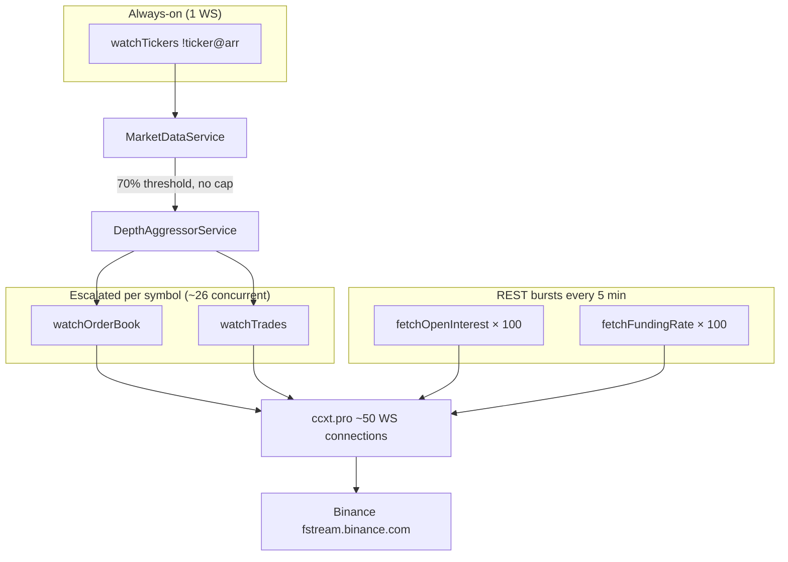

# Engine WebSocket Connection Pressure & Binance Limits

**Date:** 2026-06-08  
**Status:** WIP — operational analysis from live Docker logs. **All recommendations OPEN — no milestone in `docs/milestone-log.md` yet.** See [Milestone coverage](#milestone-coverage). Moves to [`docs/wip/done/`](done/) when no OPEN/PLANNED rows remain.  
**Trigger:** Operator reported heavy error volume in `trade-bot-engine` logs after container restart (~3h uptime at time of analysis).

---

## Milestone coverage

Tracked against [`docs/milestone-log.md`](../milestone-log.md). **Not part of the M24→M27 data-fix arc.**

| WIP recommendation | Milestone | Log status | Related design only |
|--------------------|-----------|------------|---------------------|
| P1 — cap concurrent escalations | — | **OPEN** | ADR 0001 tiered WS model; no cap implemented |
| P1 — `DepthAggressorService` retry/backoff | — | **OPEN** | — |
| P2 — stagger REST OI/funding polls | — | **OPEN** | M18 (REST rate limit) does not cover poll staggering |
| P2 — escalation hysteresis | — | **OPEN** | `APPROACHING_TRIGGER_FRACTION` in `MarketDataService` |
| P3 — ops levers (`UNIVERSE_MAX_SYMBOLS`, etc.) | — | **OPEN** | Operator config |
| P3 — wire `OI_ESCALATED_POLL_MS` | — | **OPEN** | Defined in `tieringConsts`, unused |

Cross-link: paper soak / gate work ([M24–M27](main-architector-paper-soak-fill-and-gate-analysis.md#milestone-coverage)) is independent of this connectivity track.

---

## Executive summary

1. **The engine is not crashing** — container healthy, 0 restarts, `/v1/health` passing, Binance REST ping OK from inside the container.
2. **Errors are exchange connectivity noise**, not Postgres, migrations, or NestJS boot failures.
3. **We are not above Binance's hard connection cap** (~50 ccxt WS connections vs 300/IP limit).
4. **Dominant failure mode is ping/pong keepalive timeout** on `wss://fstream.binance.com/public/ws/*` — event-loop saturation and connection churn, not "too many connections" in the Binance sense.
5. **Root drivers:** uncapped concurrent depth/trade escalations (~26 peak, 80 symbols in 30m), ccxt opening ~1 WS per stream, `DepthAggressorService` exiting loops on first error without retry, and `Promise.all(100)` REST bursts for OI/funding every 5 minutes.
6. **Highest-impact fixes (not implemented):** cap concurrent escalations, add retry/backoff in `DepthAggressorService`, stagger REST polls, optional escalation hysteresis.

---

## Container status at analysis time

| Check | Result |
|-------|--------|
| Container | `trade-bot-engine` — Up ~3h, **healthy** |
| Restarts | **0** |
| Binance REST from container | `GET /fapi/v1/ping` → `{}` OK |
| Log volume (last 3h) | 608 level-50 (error), 604 level-40 (warn) among 6,413 JSON lines |

---

## Designed connection model (ADR 0001)

Per ADR 0001, the engine uses a **tiered** subscription policy:

| Layer | What | WebSocket |
|-------|------|-----------|
| Always-on | `watchTickers()` → single `!ticker@arr` | **1** stream |
| Polled (REST) | OI + funding for full universe (100 symbols) | **0** WS |
| Escalated only | `watchOrderBook` + `watchTrades` per near-trigger symbol | **2 streams × N** |

Escalation triggers when streamed price/volume reaches **70%** of trigger thresholds (`APPROACHING_TRIGGER_FRACTION = 0.7` in `tieringConsts.ts`). Universe cap: **100 symbols** (`UNIVERSE_MAX_SYMBOLS`).

**There is no code-level cap on concurrent escalations.** ADR 0030 references an "M1 `MarketDataModule` connection budget," but no enforcement constant exists in the codebase.

Relevant code paths:

- `MarketDataService.manageEscalation()` / `applyEscalation()` — decides when to call `DepthAggressorService.start()`
- `DepthAggressorService` — one `watchOrderBook` loop + one `watchTrades` loop per escalated symbol
- `FlowPollService` — `Promise.all` over all universe symbols for OI (5 min) and funding (5 min)

---

## Runtime observations (Docker logs)

Analysis window: **last 30 minutes** of `docker logs trade-bot-engine` unless noted.

### ccxt opens ~50 WebSocket connections

Error messages reference `wss://fstream.binance.com/public/ws/0` through `ws/49` — **46–50 distinct connection indices**. ccxt.pro appears to shard subscriptions across **roughly one WS connection per depth/trade stream**, not heavy multiplexing onto a few shared connections.

### Escalation volume is high

| Metric (30 min) | Value |
|-----------------|-------|
| Unique symbols escalated | **80** (of 100 universe) |
| `start()` log lines (incl. re-starts) | **626** |
| Symbols restarted ≥5× | **51** |
| Proxy peak concurrent escalations | **~26** (30-event sliding window) |
| Last 5 min snapshot | 125 escalations, 31 errors, 31 warnings |

Top churn symbols (re-`start()` count): MOVE (40×), OP/OPG (24× each), SKYAI (18×), AVAX (17×).

### Stream math at peak

```
1   ticker stream (!ticker@arr)
+  26 symbols × 2 (order book + trades) = 52 depth/trade streams
≈ 53 subscriptions → ~50 ccxt WS connections (matches ws/0..ws/49)
```

### Error pattern breakdown (last 3h)

| Pattern | Approx. count |
|---------|---------------|
| `watchOrderBook` / `watchTrades` downstream warnings | ~420 |
| ccxt ping-pong keepalive timeout | ~233 |
| ccxt connection closed code 1006 | ~179 |
| `fetchOpenInterest` REST timeout (10s) | ~130 |
| `fetchOpenInterest` fetch failed | ~31 |
| `fetchOpenOrders` timeout (PaperExchangeNullityProbe) | 6 |
| `watchTickers` retry | 4 |
| Shadow invalid stop-loss side (guardrail) | 3 |

Non-connectivity warnings are negligible compared to market-data transport noise.

---

## Binance limits vs. engine usage

| Binance limit | Engine usage | Verdict |
|---------------|--------------|---------|
| **300 connections / IP** | ~50 | ✅ Well under |
| **1024 streams / connection** | ~1 stream per ccxt connection | ✅ Per-connection OK |
| **Ping/pong keepalive** | Must respond within ~10 min | ❌ **Failing** — dominant error |
| **10 incoming msgs/sec per connection** | Burst traffic on reconnect | ⚠️ Possible pressure during churn |
| **REST rate limits** | `Promise.all` on 100 symbols every 5 min | ⚠️ Bursts + timeouts observed |

Official futures WS docs: [Connect — USD-M market streams](https://developers.binance.com/docs/derivatives/usds-margined-futures/websocket-market-streams/Connect).

---

## Root causes (ranked)

### 1. No concurrent escalation cap

In volatile conditions many symbols hover near the 70% threshold → constant escalate/de-escalate → **626 subscription cycles in 30 minutes**. Each cycle tends to open new ccxt WS connections.

### 2. `DepthAggressorService` exits on first error (no retry)

On `watchOrderBook` / `watchTrades` failure the consume loop **`return`s** instead of sleeping and retrying (unlike `MarketDataService.streamTickers`, which logs and continues). The symbol **stays in `activeSymbols`** until de-escalated, so:

- Depth/trade loops are dead but the symbol is still "active"
- `start()` will not re-fire until de-escalation → re-escalation
- Stale depth data + amplified churn when price oscillates around the threshold

```typescript
// DepthAggressorService — current behavior on error
catch (cause) {
    this.logger.warn(`watchOrderBook failed for ${symbol}: ...`);
    return; // exits loop; symbol remains in activeSymbols
}
```

### 3. REST burst load competes with WS keepalives

`FlowPollService.pollOpenInterestFor()` and `pollFundingFor()` use `Promise.all` over **all 100 universe symbols** every 5 minutes. That can briefly starve the Node event loop → missed ping/pong across ~50 WS connections.

**Note:** `OI_ESCALATED_POLL_MS = 30_000` is defined in `tieringConsts.ts` but **never wired** — escalated symbols only get a one-shot OI poll on escalation start, not faster ongoing polling.

---

## Architecture (current data plane)



---

## Impact on trading safety

| Concern | Assessment |
|---------|------------|
| Process health | ✅ Healthy; auto-recovers |
| Global ticker / breadth | ✅ Single `!ticker@arr` retries on failure |
| Depth/spread at gate time | ⚠️ Intermittently stale when escalated streams die without retry |
| Paper nullity probe | ⚠️ Occasional `fetchOpenOrders` timeout (counted, continues) |
| Shadow strategy | ℹ️ 3 "invalid stop-loss side" skips in 3h (guardrail, not crash) |

Depth gaps can affect per-coin `coin_book_too_thin` and spread inputs when escalation streams fail mid-window. Fail-closed gate behavior limits downside (skips rather than bad fills), but reduces paper soak signal volume.

---

## Recommendations (priority order) — **all OPEN (no milestone)**

| Priority | Change | Expected effect | Milestone |
|----------|--------|-----------------|-----------|
| **P1** | Cap concurrent escalations (e.g. top 10–15 by `\|partialSigma\|`) | Cuts WS connections from ~50 to ~20–30 | **OPEN** |
| **P1** | Retry with backoff in `DepthAggressorService` (mirror `streamTickers`) | Stops zombie "active but dead" streams; fewer re-`start()` cycles | **OPEN** |
| **P2** | Stagger REST OI/funding polls (batches of 10–20, small delay) | Less event-loop starvation during 5-min bursts | **OPEN** |
| **P2** | Escalation hysteresis (e.g. escalate at 70%, de-escalate at 50%) | Fewer flip-flops at boundary | **OPEN** |
| **P3** | Ops levers: lower `UNIVERSE_MAX_SYMBOLS` or raise `APPROACHING_TRIGGER_FRACTION` | Quick relief without code change | **OPEN** |
| **P3** | Wire or remove dead `OI_ESCALATED_POLL_MS` | Align implementation with ADR 0001 "faster OI polling" intent | **OPEN** |

---

## Open questions

1. What is the right **max concurrent escalations** constant? ADR 0030 mentions a connection budget but never pinned a number.
2. Should failed escalations **force de-escalation** (clear `activeSymbols` + `state.setEscalated(false)`) on terminal WS error?
3. Is ccxt connection sharding configurable, or should we bypass ccxt for combined Binance streams long-term?
4. Do soak metrics show **depth nulls correlated with WS error bursts** on reject reasons (`coin_book_too_thin`, `spread_too_wide`)?

---

## Commands used for this analysis

```bash
docker compose ps
docker logs trade-bot-engine --tail=300
docker logs trade-bot-engine --since 3h   # piped through Python for aggregation
docker exec trade-bot-engine wget -qO- --timeout=5 https://fapi.binance.com/fapi/v1/ping
docker inspect trade-bot-engine --format '{{.State.Status}} restartCount={{.RestartCount}} health={{.State.Health.Status}}'
```

---

## Related docs

- ADR 0001 — Exchange integration & market-data boundary (`docs/architecture/adr/0001-exchange-and-market-data.md`)
- ADR 0030 — In-engine rate limit policy (WS out of scope for REST limiter; mentions connection budget)
- `docs/operations/RUNBOOK.md` — WebSocket stall detection (operator-side)
- `docs/wip/paper-soak-zero-trades-and-shadow-fill-gap.md` — separate funnel/fill analysis
